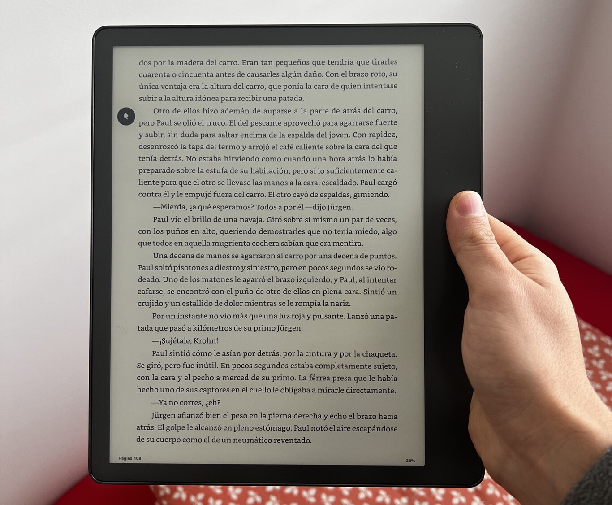
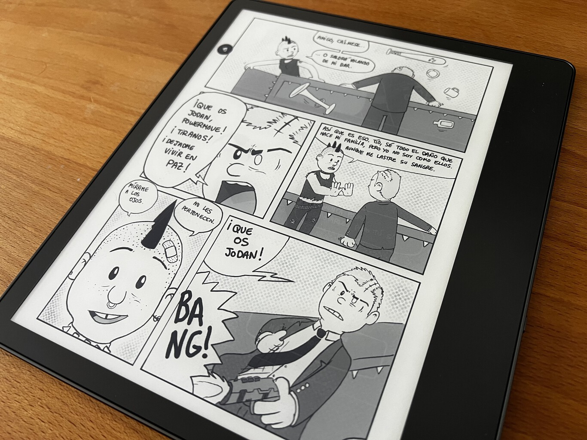
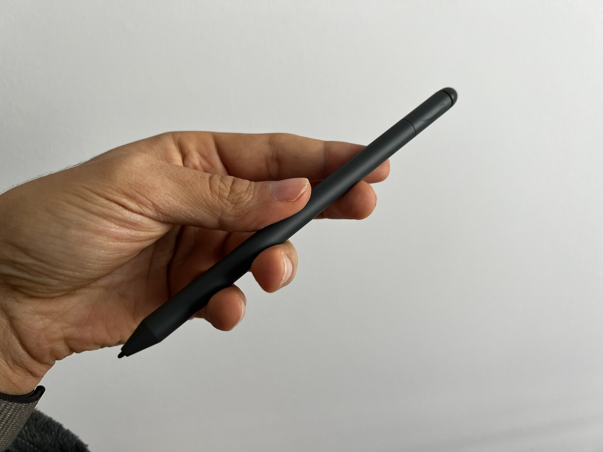
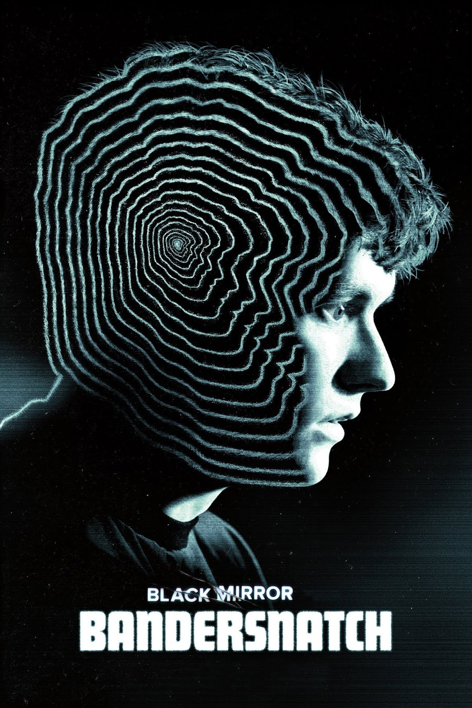
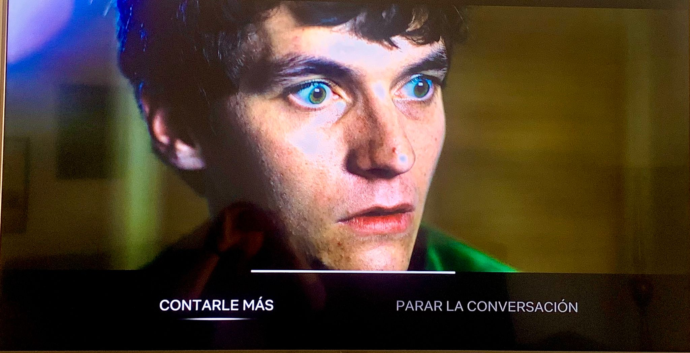

# Hibridación de software en la cultura contemporánea: Kindle Scribe & Black Mirror: Bandersnatch

### PEC3: Visionando el futuro con las gafas de Manovich

*Laura Rodríguez Castillo   | 27/05/24 | Cultura Digital*

## Introducción

 > Hoy por hoy encontraremos la hibridación y la remezcla profunda con plena vigencia operando en todas las áreas de la cultura donde se usa el software  *(Lev Manovich, 2013)*

*Lev Manovich* describe la **hibridación de los medios** como un proceso en el que diferentes lenguajes mediáticos confluyen e intercambian propiedades, generando estructuras e interacciones innovadoras. Este proceso destaca la fusión de interfaces, técnicas y presuposiciones fundamentales provenientes de diversos formatos y tradiciones, dando lugar a nuevas *gestalts de medios*. "Esto implica una fusión que ofrece una experiencia nueva y coherente, distinta de la que se tendría al experimentar los elementos de manera individual." *(Lev Manovich, 2013)*

Para ilustrar este fenómeno, Manovich emplea la metáfora de la *evolución biológica*, adaptada al contexto del software. En esta analogía, "los diversos tipos de medios son equiparados a especies que coexisten en una ecología compartida, que en este caso corresponde a un entorno de software unificado. Una vez que estos medios son *liberados* en dicho entorno, comienzan a interactuar, mutar y generar híbridos. Esta interacción es catalizada por la naturaleza integradora y flexible del software, facilitando así la emergencia de nuevas formas mediáticas que son el resultado de la combinación y reconfiguración de características preexistentes en diferentes medios." *(Lev Manovich, 2013)*

 En conclusión, la *hibridación de los medios* es fundamental para comprender cómo el software digital está redefiniendo las formas en que se crean, distribuyen y consumen los contenidos culturales. Así, la cultura mediática se transforma, permitiendo experiencias más ricas y diversificadas que antes no eran posibles.

 A continuación, vamos a examinar dos casos contemporáneos de *hibridación de medios*. He elegido estos ejemplos, en concreto, porque encapsulan una fusión entre mis dos grandes pasiones: tecnología y arte.

    - Kindle Scribe.
    - Black Mirror: Bandersnatch.
  
  Te invito a unirte a este estudio para explorar y comprender estos fenómenos a través del enfoque *manovichiano*.

## Re-descubirendo la hibridación: Puntos comunes

Tanto en el caso de **Kindle Scribe** como en el **Black Mirror: Bandersnatch** no podemos hablar de simple evolución, nos encontramos con "una nueva manera de interaccionar con el formato de medio ya existente. La *hibridación* se produce en la interfaz de usuario y en las herramientas que facilitan el proyecto, servicio o aplicación para trabajar con ese tipo de medios." *(Lev Manovich, 2013)*

"Esta lógica también coincide con la que observamos en la creación de nuevos híbridos en la biología. Es decir, el resultado de la hibridación no es tan solo la suma mecánica de las partes existentes previamente, sino una nueva «especie»." *(Lev Manovich, 2013)*

## Kindle Scribe

El **Amazon Kindle** fue lanzado al mercado en noviembre de 2007, revolucionando la manera en que los consumidores acceden y leen libros. Originalmente, este dispositivo se concibió como un lector de libros electrónicos sencillo, diseñado para emular la experiencia de la lectura en papel pero con las ventajas de la tecnología digital, como la capacidad de almacenar miles de libros en un solo dispositivo portátil y descargarlos instantáneamente. Un claro ejemplo de *re-mediación*.

Con el transcurso de los años, la gama se fue diversificando con modelos de gamas alta y más funciones, entre las que podemos destacar la resistencia al agua, diferentes tipos de iluminación, pantallas de mayor resolución y conectividad mejorada.

Este camino de innovación condujo al lanzamiento del **Kindle Scribe** en 2022, un dispositivo que marca un hito en la trayectoria de la familia *Kindle*. El *Kindle Scribe* no solo permite leer como sus predecesores, sino que también ofrece funcionalidades de escritura y dibujo gracias a un lápiz óptico. Así, se convierte en una herramienta híbrida que abarca tanto la lectura como la escritura y el dibujo, ofreciendo una experiencia más rica y versátil.

### Hibridación en Kindle Scribe

La hibridación en el *Kindle Scribe* se manifiesta a través de la convergencia entre la lectura digital, donde el dispositivo sirve principalmente como un medio para consumir contenido, y la escritura y dibujo manual, donde el dispositivo se transforma en una herramienta para generar contenido.

- **Interactividad**: El *Kindle Scribe* aumenta la interactividad con el medio, ya que permite a los usuarios no solo leer textos sino también interactuar directamente con ellos mediante anotaciones o creación de contenido propio.

- **Multimodalidad**: Aunque se centra principalmente en los modos visuales y textuales, su capacidad de permitir la escritura y el dibujo añade una capa adicional de expresión.
  
- **Experiencia Inmersiva**: No utiliza tecnologías como la realidad virtual o aumentada, pero su capacidad para permitir la escritura y el dibujo puede considerarse una forma de inmersión en la medida en que involucra al usuario activamente en la creación de notas, esquemas o ilustraciones, haciendo que el proceso de lectura sea más envolvente.

## Black Mirror: Bandersnatch

**Black Mirror: Bandersnatch** es una película interactiva británica,​ basada en la serie de ciencia ficción distópica Black Mirror. Se estrenó en Netflix​ el 28 de diciembre de 2018.

En *Bandersnatch*, el espectador, toma decisiones que afectan la trama de la película. Estas decisiones dan lugar, entre numerosas combinaciones posibles, a cinco posibles finales distintos. La película, por tanto, tiene una duración de entre 45 y 120 minutos. Sin embargo, si se decide no tomar ninguna decisión porque visionamos la película en un dispositivo que no permita la interactividad, la duración por defecto es de 90 minutos.

### Hibridación en Black Mirror: Bandersnatch

*Black Mirror: Bandersnatch* es un ejemplo sobresaliente de hibridación de medios, tal como lo describe Lev Manovich, destacándose por su innovadora fusión de tecnología, narrativa y elementos interactivos. Este film intercala el cine tradicional con componentes de videojuegos y la estructura narrativa de los libros de "Elige tu propia aventura".

- **Interactividad**: La película eleva la interactividad a un componente central del medio, donde los espectadores no son simplemente pasivos, sino activos en la construcción de la narrativa. Cada elección del espectador influye en el curso de la historia, creando una experiencia personalizada y dinámica que puede resultar en varios finales diferentes.
  
- **Multimodalidad**: Aunque predominantemente visual y auditiva, la naturaleza interactiva de *Bandersnatch* añade una capa textual a través de las opciones que se presentan en pantalla. Esta combinación de texto, imagen, y sonido permite una experiencia más rica y diversificada.

- **Experiencia Inmersiva**: Como en el caso analizado anteriormente, no utiliza realidad virtual o aumentada; no obstante, la película logra una profunda inmersión a través de la participación del espectador. Esta inmersión no sólo es más profunda que en películas tradicionales, sino que también intensifica la atencion dedicada del espectador esperando la toma de decisiones, y por tanto, el impacto emocional y cognitivo de la narrativa.
  
- **Innovación en Narrativa**: *Bandersnatch* explora territorios narrativos nuevos al permitir que las decisiones del espectador influyan directamente en el curso de la historia. Esto crea una trama compleja y ramificada que puede variar significativamente, desafiando las estructuras lineales del storytelling y presentando múltiples tramas y finales posibles que promueven el re-visionado de la película. Cabe destacar que en el transcurso de la película, también se hace referencia directa al espectador como ente que controla el destino del protagonista, lo que aumenta la originalidad en la narrativa.

## Conclusión

Es evidente que la evolución de los medios a través de la hibridación está enriqueciendo nuestras experiencias culturales y expandiendo las posibilidades de lo que los medios pueden comunicar y cómo lo comunican. Esta tendencia hacia medios más integrados y multimodales sugiere un futuro donde los límites entre los distintos tipos de medios continuarán desdibujándose y al mismo tiempo, donde podremos encontrar nuevas *especies de medios* que nuestra mente actualmente no puede imaginar ¿O tal vez sí? ¿Ya estamos en ello?

## Referencias y Bibliografía

- BANDERSNATCH:Black Mirror (2018), En Netfix [consulta: 20/05/2024]. Disponible en: [https://www.netflix.com/es/title/80988062](https://www.netflix.com/es/title/80988062)
- BANDERSNATCH:Black Mirror, Wikipedia: la enciclopedia libre. [consulta: 20/03/2024]. Disponible en: [https://es.wikipedia.org/wiki/Black_Mirror:_Bandersnatch](https://es.wikipedia.org/wiki/Black_Mirror:_Bandersnatch)
- CRISTÓBAL, Javier (2016). **Sintaxis Markdown**. En Markdown.es, 2026. [consulta: 26/03/2024]. Disponible en: [https://markdown.es/sintaxis-markdown/](https://markdown.es/sintaxis-markdown/)
- MANOVICH, LEV. (2013). **El Software toma el mando**. Barcelona: Editorial UOC.
- MARINEGEO (2018). **Adding Images to Markdown Pages**. En MarineGEO, Agosto 2018. [consulta: 25/03/2024]. Disponible en: [https://marinegeo.github.io/2018-08-10-adding-images-markdown/](https://marinegeo.github.io/2018-08-10-adding-images-markdown/)
- LÓPEZ, Miguel (2022). **Amazon Kindle Scribe, análisis: ya no podemos mirar a los Kindle de la misma forma**. En Xataka, Diciembre 2022. [consulta: 24/03/2024]. Disponible en: [https://www.xataka.com/analisis/amazon-kindle-scribe-analisis-caracteristicas-precio-especificaciones](https://www.xataka.com/analisis/amazon-kindle-scribe-analisis-caracteristicas-precio-especificaciones)
- OpenAI (2024). **ChatGPT** (versión 26 de Abril) [Large language model].He utilizado de manera limitada herramientas de IA, como ayuda en: Selección del tema de trabajo y supervisión sintáctica y de redacción. [https://chat.openai.com/chat](https://chat.openai.com/chat)
- PASTOR, Javier (2022). **El Kindle de Amazon cumple 10 años: esta ha sido su evolución en imágenes**. En Xataka, Noviembre 2019. [consulta: 24/03/2024]. Disponible en: [https://www.xataka.com/accesorios/el-kindle-de-amazon-cumple-10-anos-esta-ha-sido-su-evolucion-en-imagenes](https://www.xataka.com/accesorios/el-kindle-de-amazon-cumple-10-anos-esta-ha-sido-su-evolucion-en-imagenes)
- SPISKE, Markus (2018). **Matrix Movie** [Fotografía]. Unsplash free platform. Disponible en: [https://unsplash.com/photos/matrix-movie-still-iar-afB0QQw](https://unsplash.com/photos/matrix-movie-still-iar-afB0QQw)
- TARGA, Jordi (2024) **Visionando el futuro con las gafas de Manovich** [consulta: 26/03/2024] Disponible en: [https://github.com/jordiuoc/PEC3_Manovich_Reloaded/blob/main/README.md](https://github.com/jordiuoc/PEC3_Manovich_Reloaded/blob/main/README.md)

----

Licencia: Material Creative Commons desarrollado bajo licencia CC BY-SA 4.0. Imágenes CC BY [Tubik studio](https://blog.tubikstudio.com/how-to-create-original-flat-illustrations-designers-tips/)
